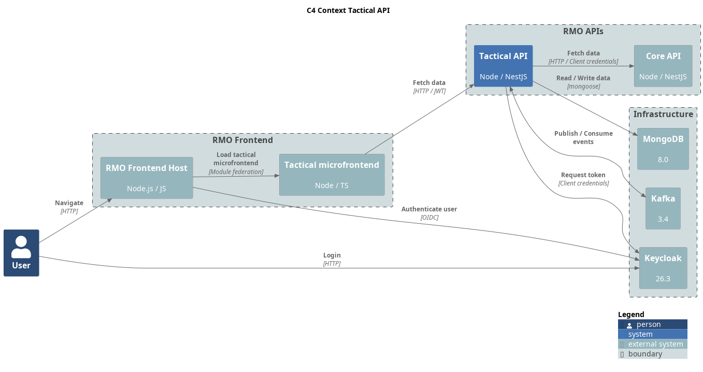

= RMU Engine Tactical API
:linkattrs:
:icons: font

image:https://img.shields.io/badge/license-GPL3.0-green.svg[License,link="https://www.gnu.org/licenses/gpl-3.0.html"]
image:https://img.shields.io/badge/rolemaster-rmu-green.svg[Rolemaster,link="http://ironcrown.co.uk/unified-rolemaster/"]
image:https://img.shields.io/badge/NestJS-11.0.1-green?logo=nestjs[NestJS, link="https://www.npmjs.com/package/@nestjs/common/v/11.0.1"]

++++

++++

REST API for combat management. Each combat (tacticalGame) is associated to a campaign (strategicGame) of the
Strategic API module.

This API allows to import characters from the strategic API or to create NPC characters. Once the characters
are defined, it allow the declaration of actions such as maneuvers or attacks.

This project is part of RMU Online: https://github.com/labcabrera/rmu-platform

WARNING: *This application is an independent project developed by fans of Rolemaster Unified. It is not affiliated with, endorsed by, or licensed by Iron Crown Enterprises (ICE), the owners of the Rolemaster intellectual property.*
*All Rolemaster trademarks, game systems, and materials are the property of Iron Crown Enterprises. This software is provided for personal, non-commercial use only. If you enjoy Rolemaster, please support the official publications and content from ICE.*

== Technologies

* NestJS
* DDD
* CQRS
* MongoDB
* Kafka
